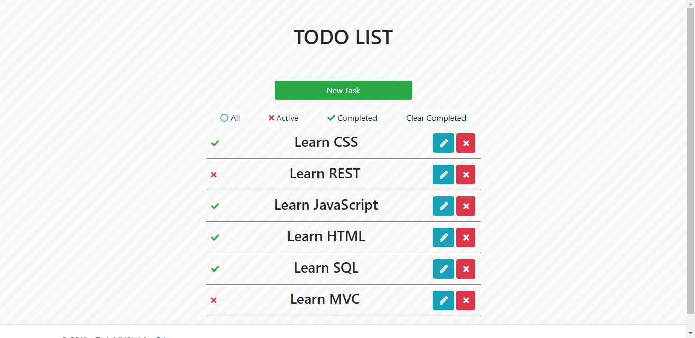

Simple TODO List app with ASP.NET Core.

## Definition

Simple app that helps you to keep track of your tasks.

## SDK Version

.NET Core 2.2

## Extra Sources

* [Font Awsome Icons](https://fontawesome.com)

* [Google Fonts ('Baloo Bhai')](https://fonts.google.com/specimen/Baloo+Bhai)

* [Bootstrap 4](https://getbootstrap.com/)

* [Subtle Patterns](https://www.toptal.com/designers/subtlepatterns/)

## Features

* Open Source

* Cross Platform

* Responsive Design

## Licesnse

This project is licensed under the MIT License - see the [LICENSE.md](https://github.com/ArtushHakobyan/todoapp-mvc/blob/master/LICENSE) file for details
